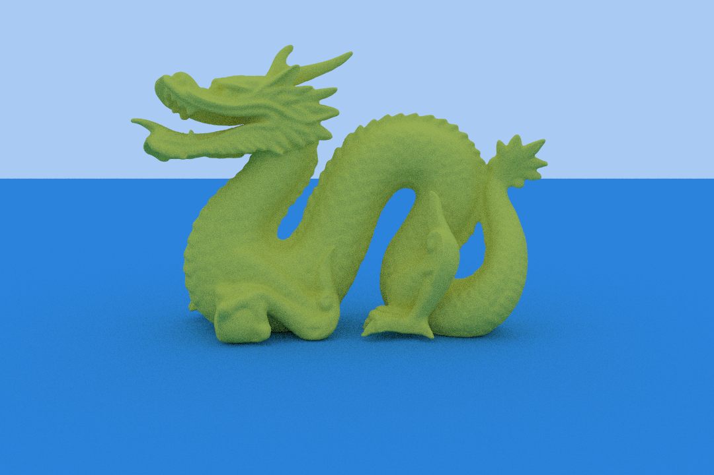

# Path tracer

This program renders 3D scenes with global illumination using Monte Carlo path tracing.

  
*Scene at `scenes/dragon/dragon.json` with 871,416 triangles. Rendered with 32 samples per pixel at 1080x720 resolution in 8.15 s on an Intel i7-7700HQ CPU.*

## Build

[First, install Rust and Cargo if you don't already have them.](https://www.rust-lang.org/learn/get-started)

Build this project with `cargo build --release`. The standalone executable at target/release/renderer is all you need, so you can move it to the main folder and run `cargo clean` to save space.

## Run

To render a scene described at scene.json into a file named output.png, run `./renderer scene.json output.png`.

## Scene format

Describe a scene with a JSON file in the following format. Positions are based on a left-handed coordinate system where +z points forward, +y points up, and +x points to the right.

```json
{
    "camera": {
        "film_dimensions": [1080, 720], 
        "origin": [0, 0.7, -3],
        "look_at": [0, 0, 2.701],
        "up": [0, 1, 0],
        "field_of_view": 45
    },

    "settings": {
        "environment": [0.4, 0.6, 0.9],
        "samples_per_pixel": 32,
        "max_ray_depth": 8
    },

    "objects": {
        "floor": {
            "type": "mesh",
            "file": "scenes/dragon/objects/floor.obj",
            "material": {
                "type": "diffuse",
                "color": [0.05, 0.39, 0.8]
            }
        },
        "dragon": {
            "type": "mesh",
            "file": "scenes/dragon/objects/dragon.obj",
            "material": {
                "type": "diffuse",
                "color": [0.8, 0.75, 0.1]
            }
        }
    }
}
```

This example renders a 1080x720px image from a camera positioned at (0, 0.7, -3) and facing towards (0, 0, 2.701) with a field of view of 45 degrees. The sky color is light blue (RGB 0.4, 0.6, 0.9) and the renderer calculates 32 samples per pixel. There are two objects: a blue floor plane mesh from floor.obj and a yellow dragon mesh from dragon.obj.

Each OBJ file should include one object made of triangles only, and will be read with the +z axis pointing forward and the +y axis pointing up. (OBJ files use right-handed coordinates, which will automatically be converted by the renderer.)

You can convert a Blender object to a scene JSON file by running `blender yourfile.blend -P scenes/scene_from_blend.py` (see the comments in scenes/scene_from_blend.py for more information).

See the scenes folder for more examples.

## Example renders

  
*`scenes/cornell/cornell.json`, 32 samples per pixel*

  
*`scenes/bunnyetc/bunnyetc.json`, 32 samples per pixel*

<!-- Update this with images and details, render times, comparisons, etc -->

## Resources

- [Physically Based Rendering: From Theory to Implementation, 4th edition](https://pbr-book.org/4ed/) by Matt Pharr, Wenzel Jakob, and Greg Humphreys. In particular, chapter 7 on acceleration structure implementation, chapter 8 on sampling, and chapter 13 on light transport theory
- [Real Time Rendering, 4th edition](https://www.realtimerendering.com/) by Tomas Akenine-Möller, Eric Haines, Naty Hoffman, Angelo Pesce, Michał Iwanicki, and Sébastien Hillaire. The ray-triangle intersection method in this path tracer is from chapter 22.8
- Fundamentals of Computer Graphics, 5th edition by Steve Marschner and Peter Shirley
- [Ray Tracing In One Weekend](https://raytracing.github.io/books/RayTracingInOneWeekend.html) by Peter Shirley, Trevor David Black, and Steve Hollasch
- Source code of [Cycles](https://projects.blender.org/blender/cycles.git), [Mitsuba 3](https://github.com/mitsuba-renderer/mitsuba3), and [LuxCoreRender](https://github.com/LuxCoreRender/LuxCore) for examples of how larger renderers are structured

<!-- Sources and more (also remember to comment and neaten code) -->
